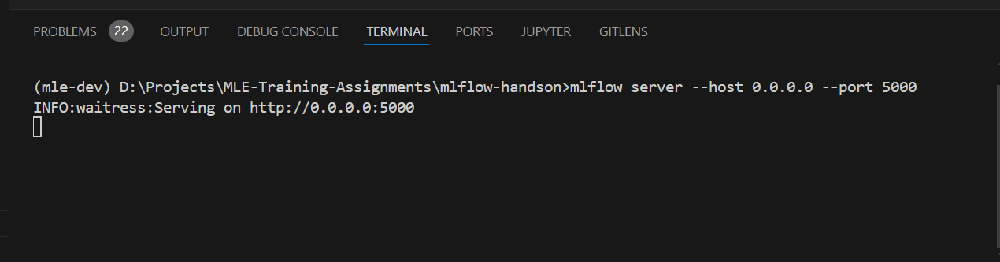
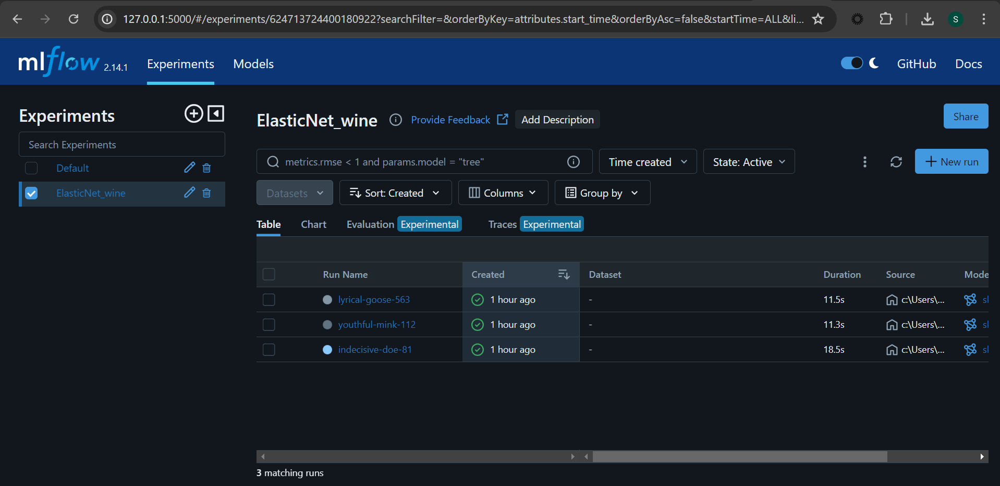
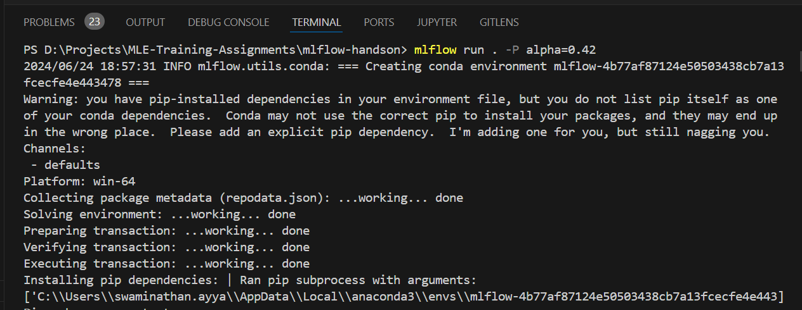
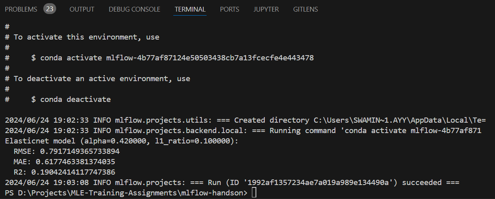

# mlflow-handson
This repository contains of the hands on practice code that gives an idea about mlflow

## Mlflow server startup in command line

## Mlflow Ui

## Packaging the experiment as mlflow conda env package
Ensure whether the MLProject is created before running the below command, along with this the conda.yaml file should be created in the root directory

This command will creates a conda environment and installs all the dependencies with the required packages that is specified on the conda.yaml file. Also one important thing is specify the mlflow.remote_uri on the train.py code and make sure the mlflow server is running before doing the build

Once every criteria is met, the build will be succeded and it will show a message like this

